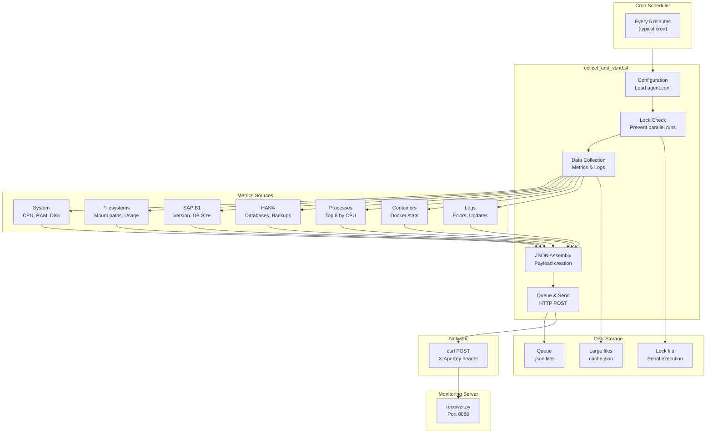
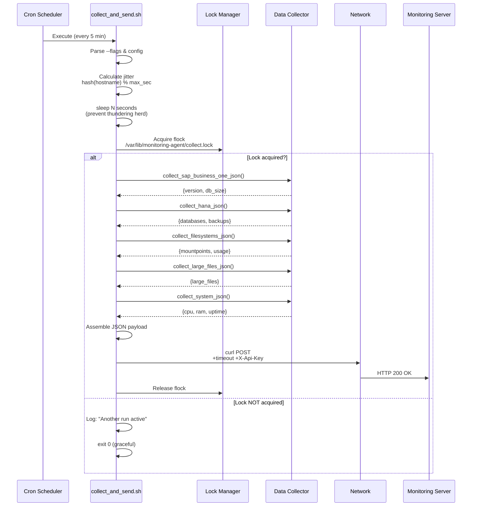
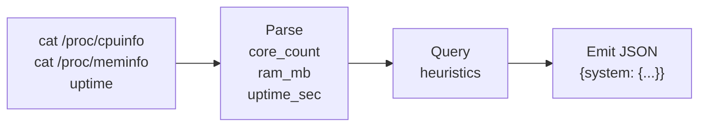
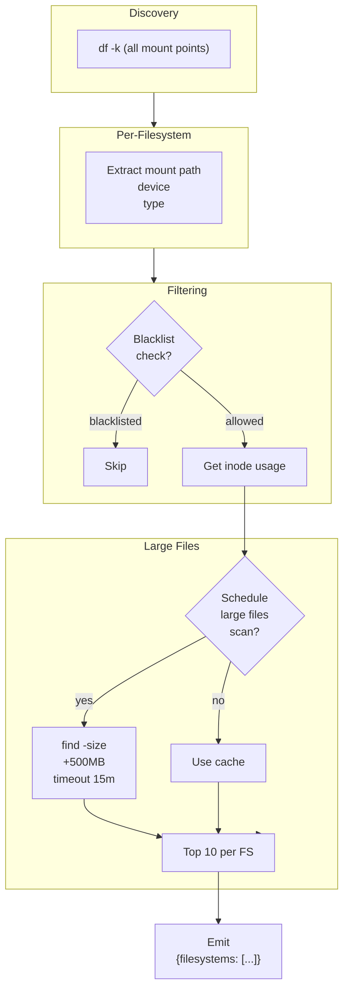
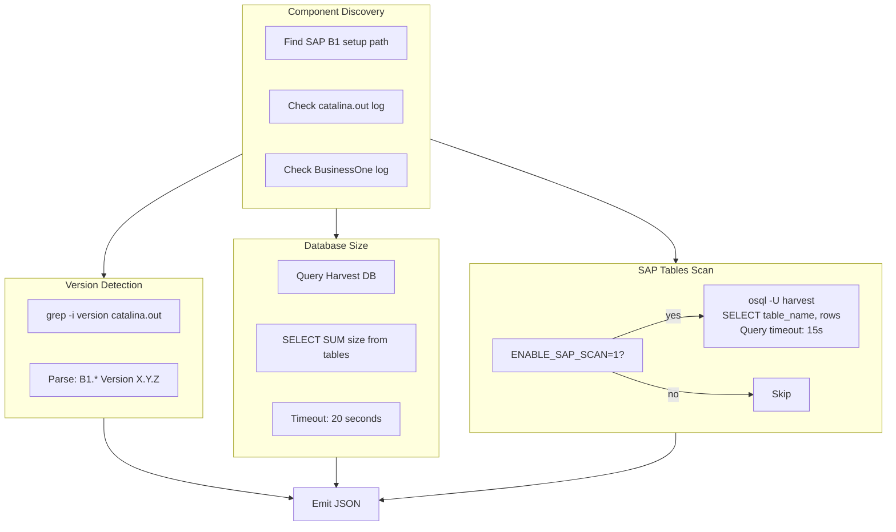
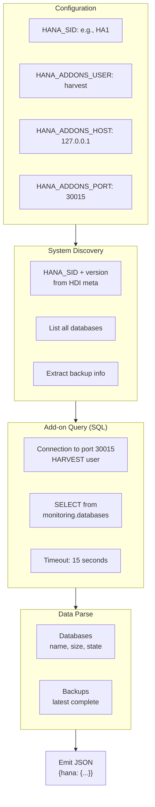
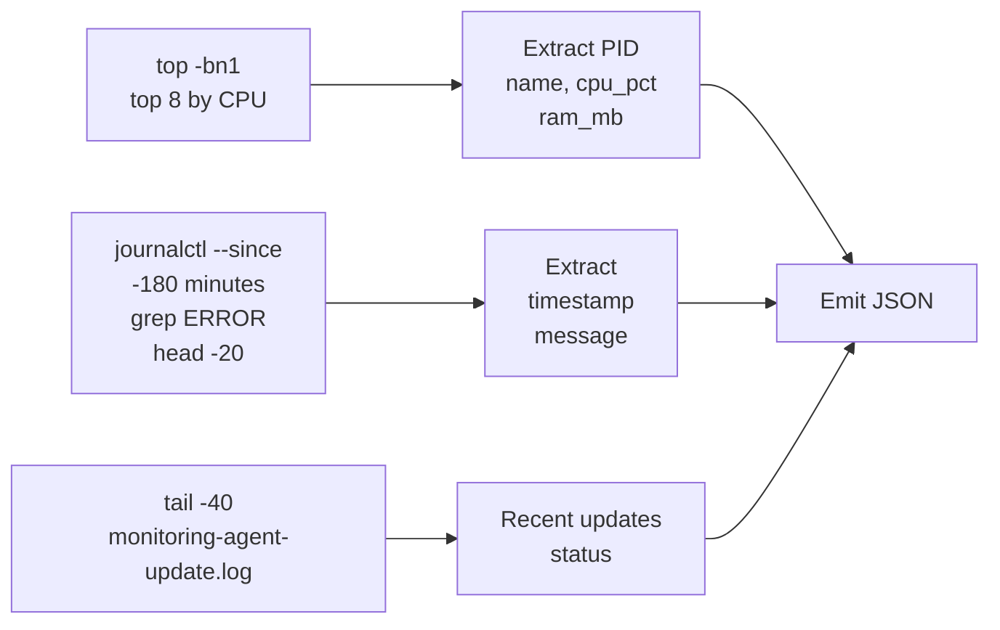
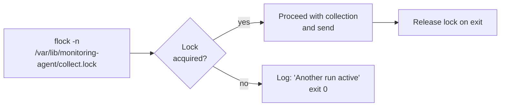
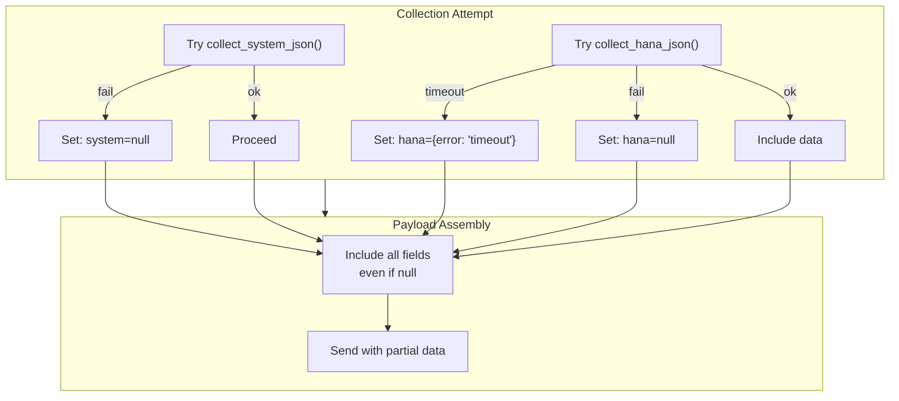
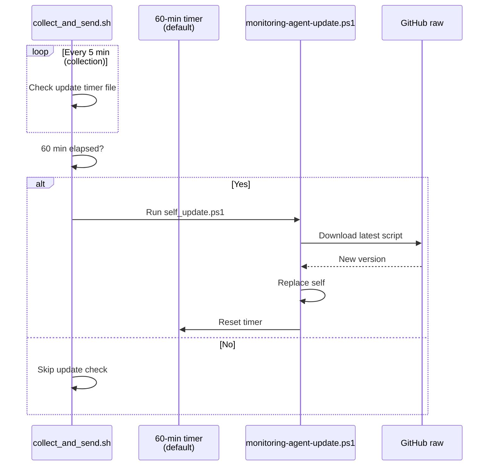

# Linux Agent – Technical Documentation

Complete technical reference for `collect_and_send.sh` – the core monitoring agent for Linux systems.

---

## Architecture Overview



---

## Execution Flow with Jitter



---

## Data Collection Pipeline

### System Metrics (`collect_system_json`)



**Fields Collected:**
- `core_count`: Number of CPU cores
- `ram_mb`: Total RAM in MB
- `uptime_sec`: System uptime in seconds
- `loadavg_1m`, `loadavg_5m`, `loadavg_15m`: Load averages

---

### Filesystem Monitoring (`collect_filesystems_json`)



**Large Files Scan Schedule:**
- Runs at configured UTC hour (default: 02:00 UTC)
- Caches results for 24 hours
- Timeout: 15 minutes per scan
- Minimum file size: 500 MB (configurable)
- Top 10 files per filesystem

**Configuration Variables:**
```bash
LARGE_FILES_SCAN_ENABLED=1              # Enable/disable
LARGE_FILES_SCAN_INTERVAL_HOURS=24      # Scan frequency
LARGE_FILES_SCAN_RUN_HOUR_UTC=2         # Hour to run (UTC)
LARGE_FILES_SCAN_TIMEOUT_SEC=900        # 15 minutes max
LARGE_FILES_MIN_SIZE_MB=500             # File size threshold
LARGE_FILES_TOP_PER_FS=10               # Results per filesystem
LARGE_FILES_EXCLUDE_PATHS="/hana/data/.snapshot"
```

---

### SAP Business One Collection (`collect_sap_business_one_json`)



**Version Timeouts:**
- Version extraction: 15 seconds
- DB size query: 20 seconds
- Tables scan: 15 seconds per query

**Failure Mode:**
- Missing SAP B1: `{sap_b1: null}`
- Query timeout: `{sap_b1: {version: null, error: "timeout"}}`

---

### HANA Collection (`collect_hana_json`)



**Fields:**
- `version`: HANA version (e.g., "2.0.70")
- `databases`: Array of databases with `name`, `size_mb`, `state`
- `backups`: Latest backup metadata

**Error Handling:**
- No HANA installed: `{hana: null}`
- Query timeout: Returns partial data or `{error: "timeout"}`

---

### Process & Log Collection



---

## Configuration & Initialization

### Config File Format

**Location:** `/etc/monitoring-agent/agent.conf` (default)

```bash
# Server connection
SERVER_URL="https://monitoring.example.com"
X_API_KEY="secret-key-here"
TLS_INSECURE="0"

# Agent identification
AGENT_ID="host-sap01"

# SAP B1 Paths (if installed)
SAP_B1_CATALINA_OUT_PATH="/usr/sap/SAPBusinessOne/Common/tomcat/logs/catalina.out"
SAP_B1_BUSINESSONE_LOG_DIR="/usr/sap/SAPBusinessOne/home/b1service0/SAP/SAP Business One/Log/BusinessOne"
SAP_B1_SETUP_PATH="/usr/sap/SAPBusinessOne/setup"
ENABLE_SAP_SCAN="1"

# HANA (if applicable)
HANA_SID="HA1"
HANA_ADDONS_USER="HARVEST"
HANA_ADDONS_PASSWORD="..."
HANA_ADDONS_HOST="127.0.0.1"
HANA_ADDONS_PORT="30015"

# Collection behavior
LARGE_FILES_SCAN_ENABLED="1"
LARGE_FILES_SCAN_RUN_HOUR_UTC="2"
LARGE_FILES_EXCLUDE_PATHS="/hana/data/.snapshot"

# Network
CURL_CONNECT_TIMEOUT_SEC="10"
CURL_MAX_TIME_SEC="45"
SEND_JITTER_MAX_SEC="300"
```

### Environment Variable Overrides

All configuration can be overridden via environment variables:

```bash
CONFIG_FILE=/custom/path/agent.conf \
LARGE_FILES_SCAN_ENABLED=0 \
./collect_and_send.sh --no-jitter
```

---

## Jitter Mechanism

**Purpose:** Prevent thundering herd when 100+ agents run simultaneously.

**Algorithm:**
```bash
jitter_identity="${AGENT_ID:-$(hostname -f)}"
jitter_sec="$(echo "$jitter_identity" | cksum | awk '{print $1 % (max + 1)}')"
sleep "$jitter_sec"  # 0 to max_sec (default: 0-300)
```

**Rationale:**
- Uses deterministic hash of hostname → same delay every cycle
- Spreads agent sends across 5-minute window
- Can be disabled: `./collect_and_send.sh --no-jitter`

---

## Locking & Serialization

### Concurrent Execution Prevention



**Why Important:**
- Previous run takes >5 minutes (network timeout, slow SAP scan)
- Prevent duplicate reports to server
- Prevent concurrent file access (large files cache)

**Implementation:**
```bash
exec 9>"$COLLECT_LOCK_FILE"
if ! flock -n 9; then
  echo "Another collect_and_send run is still active; skipping this cycle." >&2
  exit 0
fi
```

---

## JSON Payload Structure

**Example Report:**

```json
{
  "hostname": "sap-prod-01",
  "agent_version": "1.4.86",
  "collected_at_utc": "2026-05-12T14:32:45Z",
  "system": {
    "core_count": 16,
    "ram_mb": 32768,
    "uptime_sec": 1209600,
    "loadavg_1m": 2.5,
    "loadavg_5m": 2.1,
    "loadavg_15m": 1.9
  },
  "filesystems": [
    {
      "mountpoint": "/",
      "device": "/dev/sda1",
      "used_mb": 245760,
      "total_mb": 524288,
      "usage_pct": 46.9,
      "inode_used": 1234567,
      "inode_total": 2097152,
      "inode_usage_pct": 58.8,
      "large_files": [
        {"path": "/var/lib/big-file.db", "size_mb": 8192},
        {"path": "/var/log/archive.log", "size_mb": 2048}
      ]
    }
  ],
  "sap_b1": {
    "version": "10.00.251 PL15 HF1",
    "database_size_mb": 4096,
    "tables": [
      {"name": "OINV", "rows": 125000},
      {"name": "INV1", "rows": 500000}
    ]
  },
  "hana": {
    "version": "2.0.70",
    "databases": [
      {
        "name": "SYSTEMDB",
        "size_mb": 16384,
        "state": "OK"
      }
    ],
    "backups": {
      "latest_complete": "2026-05-12T02:00:00Z"
    }
  },
  "processes": [
    {"pid": 1234, "name": "sapsrv04", "cpu_pct": 15.2, "ram_mb": 2048}
  ],
  "system_logs": {
    "errors_since_180m": [
      {"timestamp": "2026-05-12T12:30:45Z", "message": "out of memory"}
    ]
  },
  "update_log": {
    "last_lines": ["v1.4.86: Applied", "Check: OK"]
  }
}
```

---

## Error Handling & Resilience

### Graceful Degradation



**Philosophy:**
- A single SAP B1 timeout should NOT prevent HANA data from being sent
- Report with `sap_b1: null` is better than no report at all
- Partial data enables alerting on what IS working

---

## Update Checking & Auto-Update

### Priority Update Mechanism



**Configuration:**
```bash
PRIORITY_UPDATE_CHECK_MINUTES=60
PRIORITY_UPDATE_STATE_FILE=/var/lib/monitoring-agent/last_priority_update_check
UPDATE_LOG_FILE=/var/log/monitoring-agent-update.log
UPDATE_LOG_LINES=40  # Include last 40 lines in report
```

---

## Testing & Debugging

### Manual Test Run

```bash
# Run once, with jitter disabled, custom config
CONFIG_FILE=/etc/monitoring-agent/agent.conf \
./collect_and_send.sh --no-jitter

# Override timeout
./collect_and_send.sh --jitter-max-sec 10

# Check lock
lsof /var/lib/monitoring-agent/collect.lock
```

### Debugging Slow Collections

```bash
# Time the entire script
time /usr/bin/collect_and_send.sh --no-jitter

# See which collectors are slow:
strace -c -o profile.txt ./collect_and_send.sh --no-jitter
cat profile.txt

# Check SAP B1 timeout
SAP_B1_VERSION_TIMEOUT_SEC=30 ./collect_and_send.sh --no-jitter

# Disable expensive scans
LARGE_FILES_SCAN_ENABLED=0 \
ENABLE_SAP_SCAN=0 \
./collect_and_send.sh --no-jitter
```

### Queue Inspection

```bash
# See queued reports
ls -la /var/lib/monitoring-agent/queue/

# Check cache
cat /var/lib/monitoring-agent/large-files-cache.json | jq .

# Manually trigger large files scan
touch /tmp/large-files-force-scan
LARGE_FILES_SCAN_FORCE=1 ./collect_and_send.sh --no-jitter
```

---

## Performance Characteristics

| Operation | Typical Time | Timeout | Notes |
|-----------|--------------|---------|-------|
| System metrics | 50-100ms | N/A | Always fast |
| Filesystem discovery | 100-200ms | N/A | `df` call |
| Large files scan (cold) | 5-15s | 900s | First run of day |
| Large files scan (warm) | <10ms | N/A | Using cache |
| SAP B1 version | 2-5s | 15s | Log grep + version parse |
| SAP B1 DB size | 2-10s | 20s | SQL query to Harvest |
| SAP B1 tables scan | 5-20s | 15s | Multi-table query |
| HANA query | 1-5s | 15s | hdisql connection + query |
| JSON assembly | 50-100ms | N/A | String building |
| curl POST | 500ms-2s | 45s | Network + server processing |
| **Total typical** | **15-30s** | N/A | 5-min interval |

**Recommendations:**
- Run large files scan in off-peak hours (configure `LARGE_FILES_SCAN_RUN_HOUR_UTC`)
- If collections >2 minutes, consider disabling optional scans
- Monitor `/var/log/monitoring-agent-update.log` for issues

---

## Installation & Setup

### Prerequisites

```bash
# Required commands
- bash 4.0+
- curl
- awk, grep, sed, cat, ls, df, uptime
- timeout command
- flock (optional, for locking)

# For SAP B1 monitoring
- osql (SAP client)
- Access to SAP B1 Harvest DB

# For HANA monitoring
- hdisql or direct SQL client
- Network access to HANA port 30015 (or configured)
```

### Cron Setup

```bash
# Install script to system path
sudo cp collect_and_send.sh /usr/local/bin/

# Add to crontab (every 5 minutes)
*/5 * * * * /usr/local/bin/collect_and_send.sh >> /var/log/monitoring-agent.log 2>&1

# Verify
crontab -l | grep collect_and_send
```

---

## Troubleshooting

| Issue | Diagnosis | Solution |
|-------|-----------|----------|
| "Another collect_and_send run is still active" | Previous run exceeded 5 min | Increase timeout or check network |
| "Config file not found" | Missing `/etc/monitoring-agent/agent.conf` | Install config from template |
| "SERVER_URL is not set" | Config loaded but variable empty | Check config parsing |
| HANA collection fails silently | Timeout or SQL error | Enable debug: `set -x` and rerun |
| Large files cache never updates | `LARGE_FILES_SCAN_ENABLED=0` or time never hits | Check hour: `date +%H`, verify `LARGE_FILES_SCAN_RUN_HOUR_UTC` |
| SAP B1 version shows `null` | Log file not found or parse fails | Check path: `SAP_B1_CATALINA_OUT_PATH` |
