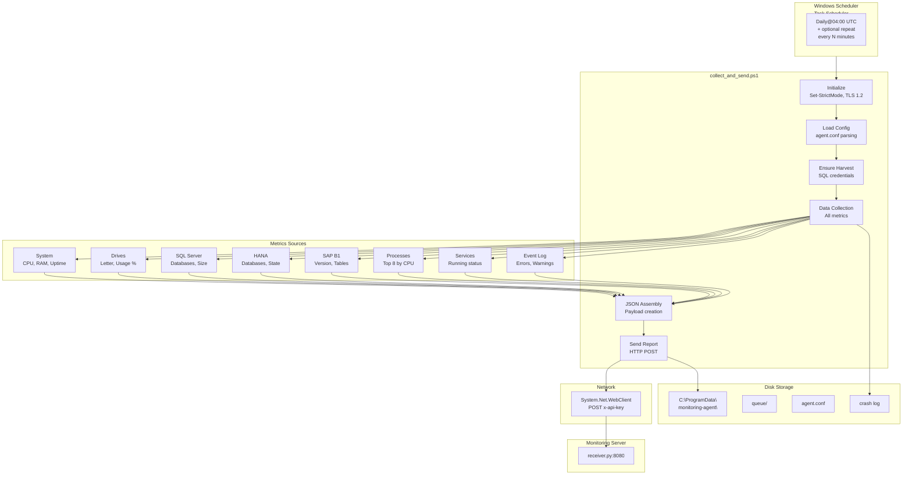
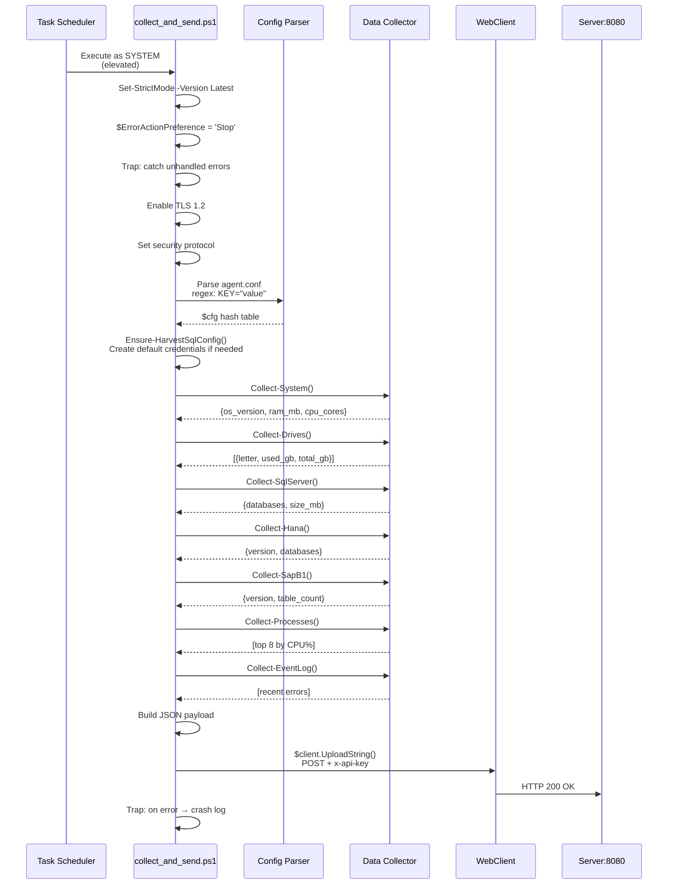
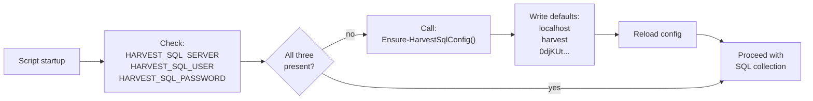
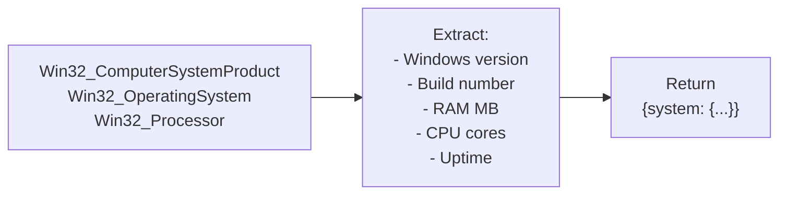
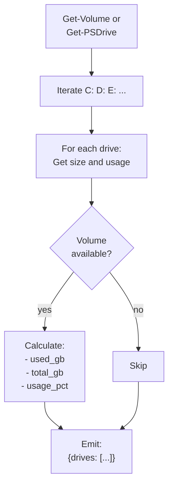
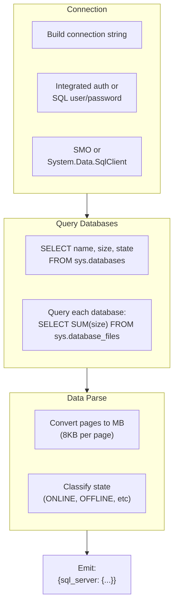
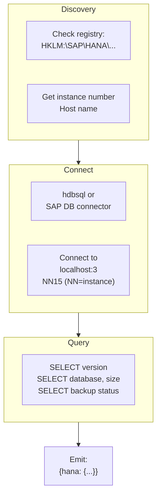
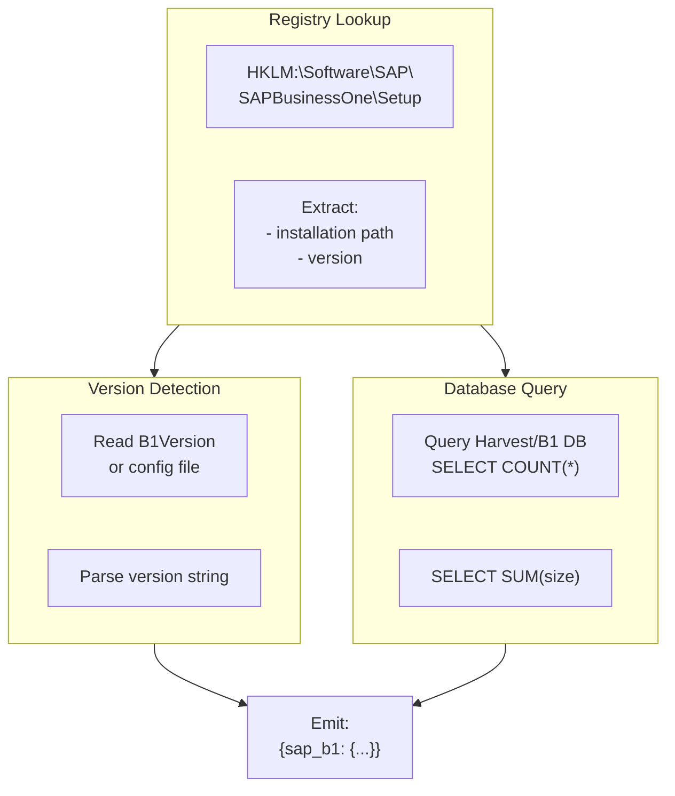
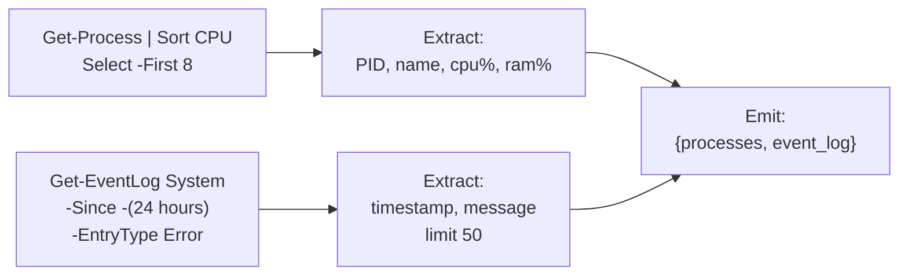
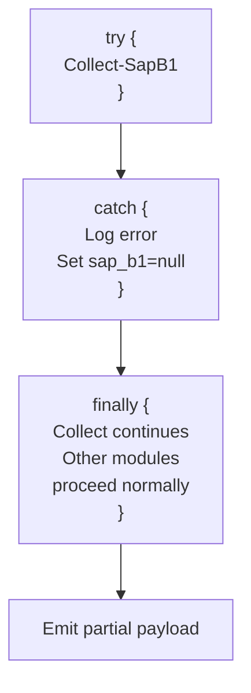

# Windows Agent – Technical Documentation

Complete technical reference for `collect_and_send.ps1` – the monitoring agent for Windows systems (HANA, SAP B1, SQL Server).

---

## Architecture Overview



---

## Execution Flow



---

## Configuration System

### Config File Format

**Location:** `C:\ProgramData\monitoring-agent\agent.conf`

```powershell
# Server connection
SERVER_URL="https://monitoring.example.com"
X_API_KEY="secret-key-here"
TLS_INSECURE="0"

# System identification
AGENT_ID="win-sap01"
ENABLE_WIN_AUTH="0"

# SQL Server (local or remote)
HARVEST_SQL_SERVER="localhost"
HARVEST_SQL_USER="harvest"
HARVEST_SQL_PASSWORD="0djKUt&xbLK0AYr"
HARVEST_SQL_DB="Harvest"
ENABLE_SQL_MONITORING="1"

# SAP B1 (Windows installer)
SAP_B1_INSTALL_PATH="C:\Program Files\SAP\SAPBusinessOne\"
SAP_REGISTRY_PATH="HKLM:\Software\SAP\SAPBusinessOne\Setup\"
ENABLE_SAP_SCAN="1"

# HANA (if on same machine)
HANA_INSTANCE_NUMBER="00"
HANA_ADMIN_USER="SYSTEM"
HANA_ADMIN_PASSWORD="..."
ENABLE_HANA="1"

# Collection behavior
TOP_PROCESSES_LIMIT=8
EVENT_LOG_HOURS=24
EVENT_LOG_LIMIT=50
```

### Config Parsing

```powershell
# Pattern: KEY="value" or KEY=value
if ($line -match '^\s*([A-Za-z_][A-Za-z0-9_]*)\s*=\s*"(.*?)"\s*$') {
    $cfg[$Matches[1]] = $Matches[2]  # Quoted value
} elseif ($line -match '^\s*([A-Za-z_][A-Za-z0-9_]*)\s*=\s*(\S+)\s*$') {
    $cfg[$Matches[1]] = $Matches[2]  # Unquoted value
}
```

---

## Auto-Configuration: Harvest SQL Setup



**Idempotent Behavior:**
- Only adds credentials if ALL three are missing
- If only one is set, preserves existing values
- Never overwrites user-provided credentials

---

## Data Collection Modules

### System Metrics (`Collect-System`)



**Fields:**
- `os_version`: e.g., "Windows Server 2019"
- `build_number`: e.g., "17763"
- `ram_mb`: Total RAM
- `cpu_cores`: Logical processor count
- `uptime_seconds`: Time since last boot

---

### Drive Monitoring (`Collect-Drives`)



**Error Handling:**
- USB/external drives not always available
- CD-ROM drives excluded
- Network shares optional (configurable)

---

### SQL Server Collection (`Collect-SqlServer`)



**Fields:**
- `version`: e.g., "2019 Enterprise"
- `databases`: Array of `{name, size_mb, state}`
- `connection_string`: Used for connection (masked in logs)

**Error Handling:**
- Server offline: `{sql_server: null}`
- Permission denied: `{sql_server: {error: "access denied"}}`
- Query timeout: Returns partial data

---

### HANA Collection (`Collect-Hana`)



**Configuration:**
```powershell
$hanaInstanceNumber = $cfg['HANA_INSTANCE_NUMBER']  # e.g., "00"
$hanaPort = 3 * 10 * $hanaInstanceNumber + 13  # 00 → 13, 01 → 43
# Connection: localhost:30013
```

---

### SAP B1 Collection (`Collect-SapB1`)



**Error Handling:**
- B1 not installed: `{sap_b1: null}`
- Registry key missing: Uses fallback paths
- DB query fails: `{sap_b1: {error: "query failed"}}`

---

### Process & Event Log Collection



---

## JSON Payload Structure

**Example Windows Report:**

```json
{
  "hostname": "SAP-PROD-WIN01",
  "agent_version": "1.4.73",
  "collected_at_utc": "2026-05-12T14:32:45Z",
  "system": {
    "os_version": "Windows Server 2019",
    "build_number": "17763",
    "ram_mb": 65536,
    "cpu_cores": 32,
    "uptime_seconds": 2592000
  },
  "drives": [
    {
      "letter": "C:",
      "used_gb": 450,
      "total_gb": 1000,
      "usage_pct": 45.0
    },
    {
      "letter": "D:",
      "used_gb": 3200,
      "total_gb": 4000,
      "usage_pct": 80.0
    }
  ],
  "sql_server": {
    "version": "2019 Enterprise",
    "databases": [
      {
        "name": "SAPHanaResources",
        "size_mb": 8192,
        "state": "ONLINE"
      },
      {
        "name": "Harvest",
        "size_mb": 4096,
        "state": "ONLINE"
      }
    ]
  },
  "hana": {
    "version": "2.0.70.00.1654321875",
    "databases": [
      {
        "name": "SYSTEMDB",
        "size_mb": 32768,
        "state": "OK"
      }
    ],
    "backups": {
      "latest_complete": "2026-05-12T02:00:00Z"
    }
  },
  "sap_b1": {
    "version": "10.00.251 PL 15 HF 1",
    "table_count": 156,
    "database_size_mb": 5120
  },
  "processes": [
    {
      "pid": 4321,
      "name": "sap_db_process.exe",
      "cpu_percent": 18.5,
      "ram_mb": 2048
    }
  ],
  "event_log": {
    "errors_last_24h": [
      {
        "timestamp": "2026-05-12T11:30:00Z",
        "source": "DISK",
        "event_id": 7001,
        "message": "The Disk was not able to..."
      }
    ]
  }
}
```

---

## Error Handling & Resilience

### Global Crash Trap

```powershell
trap {
    $crashMsg = "COLLECT_CRASH $(([System.DateTime]::UtcNow).ToString('yyyy-MM-ddTHH:mm:ssZ')): $($_.Exception.Message)"
    
    # Log to stdout (captured by Task Scheduler)
    Write-Host $crashMsg
    
    # Persist to file
    $crashFile = 'C:\ProgramData\monitoring-agent\last-collect-crash.txt'
    [System.IO.File]::WriteAllText($crashFile, "$crashMsg`n$($_.ScriptStackTrace)`n", [System.Text.Encoding]::UTF8)
    
    break
}
```

**Crash Log Inspection:**
```powershell
Get-Content 'C:\ProgramData\monitoring-agent\last-collect-crash.txt'
```

---

### Graceful Degradation Pattern



**Example:**
```powershell
try {
    $sapB1Data = Collect-SapB1
} catch {
    Write-Warning "SAP B1 collection failed: $_"
    $sapB1Data = $null
}

# Continue collecting HANA, SQL, etc.
# Report includes: sap_b1: null, hana: {...}, sql_server: {...}
```

---

## Secure Credential Handling

### Password Storage

**In Config File:**
```powershell
HARVEST_SQL_PASSWORD="0djKUt&xbLK0AYr"
HANA_ADMIN_PASSWORD="..."
```

**Risks:**
- Plain text in config file
- Visible in running process memory
- Included in crash logs (if not filtered)

**Mitigation:**
1. Store `agent.conf` with restrictive ACL (`SYSTEM` + `Administrators` only)
2. Never log `$cfg` hash table directly
3. Filter passwords in crash logs:
   ```powershell
   $crashMsg = $crashMsg -replace $cfg['.*PASSWORD.*'], "[REDACTED]"
   ```

### Credential Handling for SQL/HANA

```powershell
# Load from config
$sqlPassword = $cfg['HARVEST_SQL_PASSWORD']

# Create connection (in memory only)
$connection = New-Object System.Data.SqlClient.SqlConnection
$connection.ConnectionString = "Server=$server;User Id=$user;Password=$sqlPassword;..."

# Use connection
$connection.Open()

# Dispose (clears sensitive data)
$connection.Dispose()
$sqlPassword = $null  # Explicit cleanup
```

---

## Task Scheduler Integration

### Scheduled Task Setup

```powershell
# Create task running every 5 minutes (10 PM - 6 AM)
$action = New-ScheduledTaskAction -Execute 'powershell.exe' `
    -Argument '-NoProfile -WindowStyle Hidden -File C:\Program Files\monitoring-agent\collect_and_send.ps1'

$trigger = @()
$trigger += New-ScheduledTaskTrigger -Daily -At "22:00"  # Start at 10 PM
$trigger += New-ScheduledTaskTrigger -Once -At "22:00" -RepetitionInterval (New-TimeSpan -Minutes 5) -RepetitionDuration (New-TimeSpan -Hours 8)

Register-ScheduledTask -TaskName 'MonitoringAgent' `
    -Action $action `
    -Trigger $trigger `
    -Principal (New-ScheduledTaskPrincipal -UserID "SYSTEM" -RunLevel Highest)
```

### Log Inspection

```powershell
# Task Scheduler history
Get-ScheduledTaskInfo -TaskName 'MonitoringAgent'

# Last run result
$lastTask = Get-ScheduledTask -TaskName 'MonitoringAgent'
$lastTask.State  # Running, Ready, Disabled
```

---

## Network & Security

### TLS Configuration

```powershell
# Enforce TLS 1.2 (older Windows versions default to TLS 1.0)
[Net.ServicePointManager]::SecurityProtocol = [Net.SecurityProtocolType]::Tls12

# Disable certificate revocation check (if needed)
[Net.ServicePointManager]::CheckCertificateRevocationList = $false

# Disable 100-Continue (improves compatibility)
[Net.ServicePointManager]::Expect100Continue = $false
```

### HTTP POST with API Key

```powershell
$client = New-Object System.Net.WebClient

$headers = @{
    'X-Api-Key' = $cfg['X_API_KEY']
    'Content-Type' = 'application/json'
}

$client.Headers.Add('X-Api-Key', $cfg['X_API_KEY'])

$jsonData = ConvertTo-Json -InputObject $payload -Depth 10 -Compress

$response = $client.UploadString($cfg['SERVER_URL'], "POST", $jsonData)
```

**Timeout Handling:**
```powershell
$client.UploadStringAsync() with timeout wrapper
# OR
Use Invoke-WebRequest with -TimeoutSec
```

---

## Testing & Debugging

### Manual Test Run

```powershell
# Run in current session (with output)
& 'C:\Program Files\monitoring-agent\collect_and_send.ps1' -Verbose

# Run as SYSTEM (via Task Scheduler)
schtasks /run /tn "MonitoringAgent" /i

# Check output
Get-ScheduledTaskInfo -TaskName 'MonitoringAgent' | Select LastRunResult, LastRunTime
```

### Debugging Steps

```powershell
# 1. Check config is readable
Get-Content 'C:\ProgramData\monitoring-agent\agent.conf'

# 2. Verify credentials
$cfg = @{}
$pwd = (Get-Content 'C:\ProgramData\monitoring-agent\agent.conf' | % { ... })
Write-Host "SQL Server: $($cfg['HARVEST_SQL_SERVER'])"
Write-Host "User: $($cfg['HARVEST_SQL_USER'])"

# 3. Test SQL connection
$conn = New-Object System.Data.SqlClient.SqlConnection
$conn.ConnectionString = "Server=$($cfg['HARVEST_SQL_SERVER']);User Id=$($cfg['HARVEST_SQL_USER']);Password=$($cfg['HARVEST_SQL_PASSWORD']);"
$conn.Open()
Write-Host "SQL: Connected"
$conn.Close()

# 4. Enable verbose output
$VerbosePreference = 'Continue'
& '.\collect_and_send.ps1'
```

### Check Last Crash

```powershell
$crashLog = Get-Content 'C:\ProgramData\monitoring-agent\last-collect-crash.txt' -ErrorAction SilentlyContinue
if ($crashLog) {
    Write-Host "Last crash:"
    $crashLog
} else {
    Write-Host "No crashes recorded"
}
```

---

## Performance Characteristics

| Operation | Typical Time | Timeout | Notes |
|-----------|--------------|---------|-------|
| System metrics | 100-200ms | N/A | WMI queries |
| Drives enumeration | 50-100ms | N/A | Fast I/O |
| SQL Server connection | 500ms-2s | 30s | Network if remote |
| SQL database query | 1-5s | 30s | Per database |
| HANA connection | 1-3s | 20s | Registry + socket |
| HANA query | 2-10s | 20s | Full database list |
| SAP B1 registry lookup | 50-100ms | N/A | Fast |
| SAP B1 DB query | 2-8s | 20s | SQL to Harvest |
| Event log scan | 500ms-2s | N/A | System event log |
| Process collection | 100-200ms | N/A | Get-Process |
| JSON serialization | 100-500ms | N/A | ConvertTo-Json |
| **Total typical** | **10-40s** | N/A | 5-min interval |

---

## Troubleshooting

| Issue | Diagnosis | Solution |
|-------|-----------|----------|
| Task runs but no reports sent | Check crash log | `Get-Content C:\ProgramData\monitoring-agent\last-collect-crash.txt` |
| "Access denied" on config file | Permission issue | Run as SYSTEM; verify ACL on `agent.conf` |
| SQL connection fails | Auth or network | Verify `HARVEST_SQL_SERVER`, credentials in `agent.conf` |
| HANA not found | Registry lookup failed | Check instance number in config |
| High CPU on collection | SAP B1 or HANA query slow | Disable `ENABLE_SAP_SCAN` temporarily |
| Event log import very large | Too many events | Reduce `EVENT_LOG_HOURS` or `EVENT_LOG_LIMIT` |
| `last-collect-crash.txt` contains timeout | Slow network or component | Increase timeout or run at different time |

---

## Version Management

### Embedded Version

Located in script header:
```powershell
$EmbeddedAgentVersion = '1.4.73'
```

Updated with `bulk_update_agents.ps1` when new release is deployed.

### Version Check

```powershell
# In payload
"agent_version": "1.4.73"

# Server can:
- Compare against AGENT_VERSION file
- Suggest update if outdated
- Log version mismatch for auditing
```

---

## Production Deployment Checklist

- [ ] Config file created with correct `SERVER_URL` and `X_API_KEY`
- [ ] SQL Server credentials configured (or auto-provisioned)
- [ ] HANA instance number correct (if applicable)
- [ ] SAP B1 installation path verified
- [ ] Scheduled task created and tested
- [ ] First report received on server
- [ ] Crash log checked (should be empty)
- [ ] Event Viewer shows no errors in Task Scheduler logs
- [ ] Network firewall allows outbound HTTPS to server
- [ ] Performance acceptable (<40 seconds per cycle)
