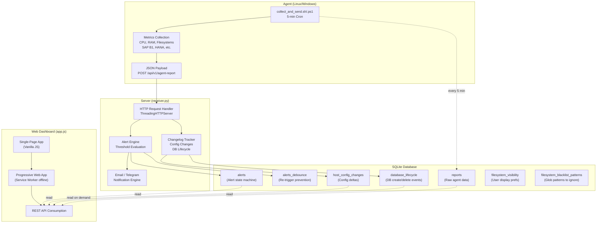
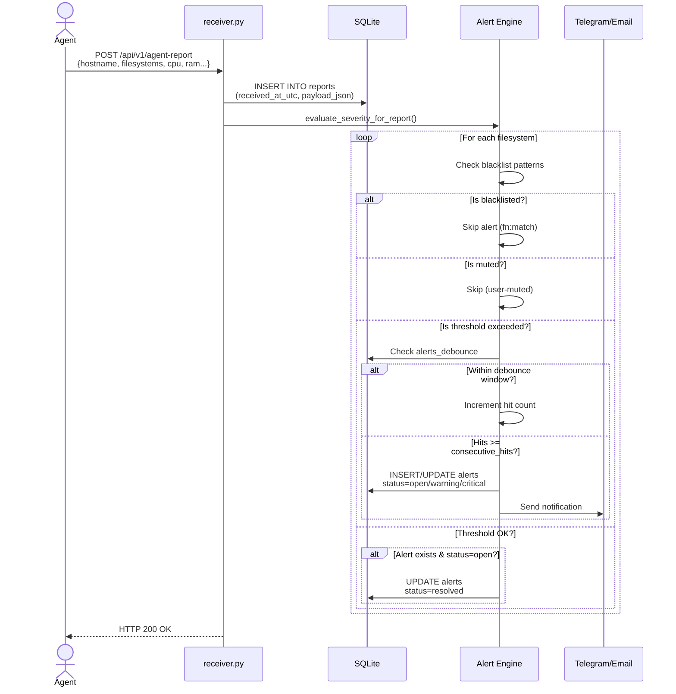
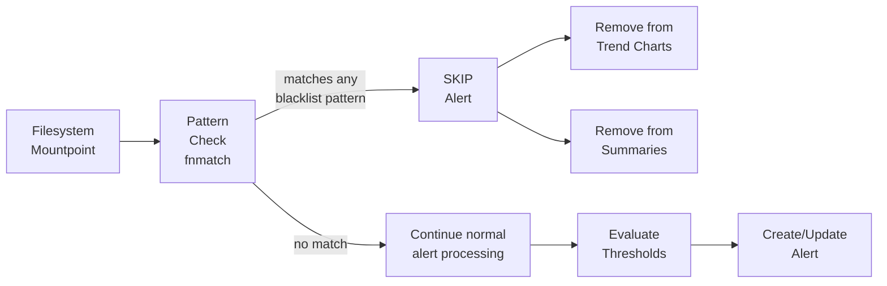
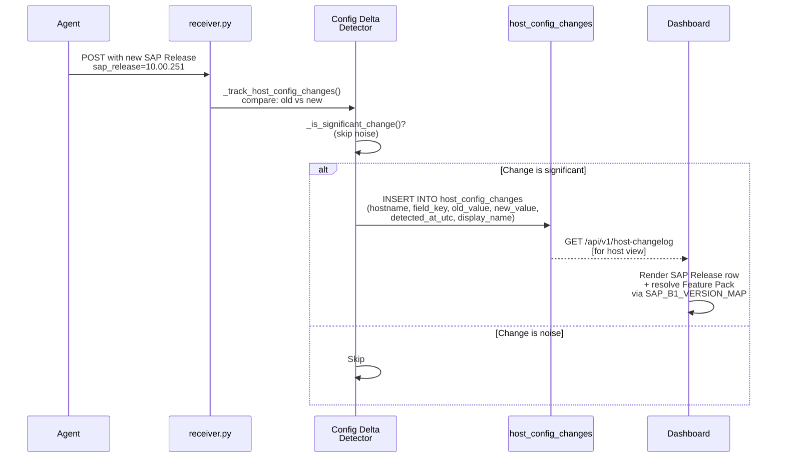
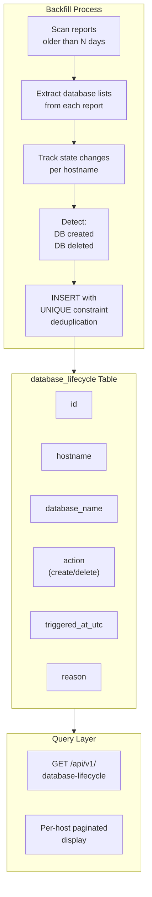
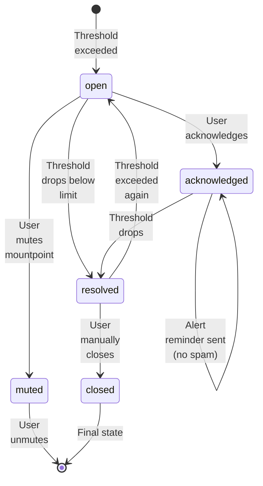
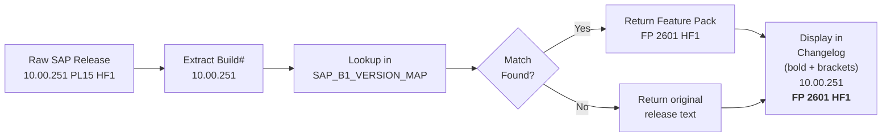
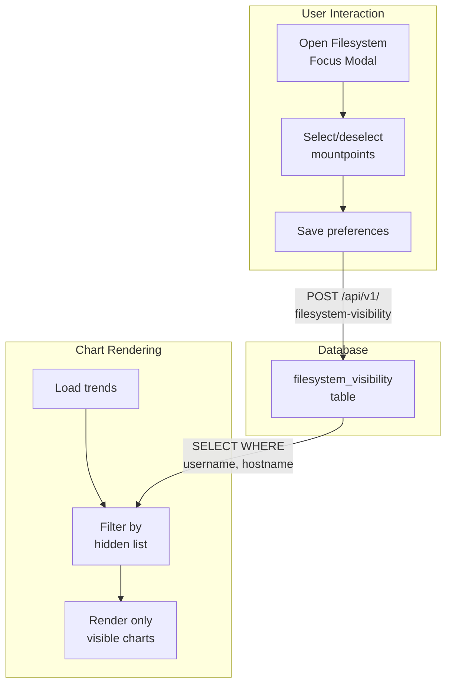
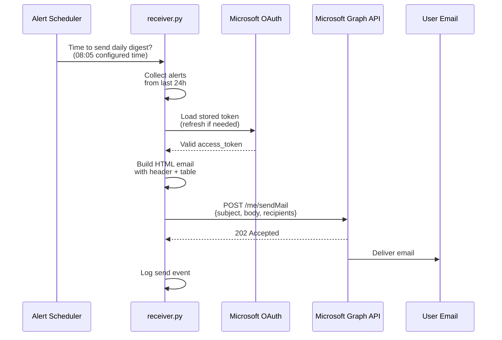
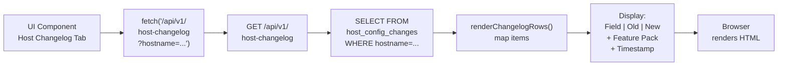

# Monitoring – Technical Design & Architecture

Detaillierte technische Dokumentation mit Architektur-Diagrammen, Datenflüssen und Prozessabläufen.

---

## System Architecture



---

## Report Ingestion Flow



---

## Filesystem Blacklist Processing



**Blacklist Patterns Checked At:**
1. Alert creation/update (`update_alerts_for_report()`)
2. Analysis trend data collection (`/api/v1/analysis`)
3. Large files collection (implicit via trend filtering)
4. Startup initialization (`resolve_open_blacklisted_alerts()`)

---

## Config Changelog Capture



---

## Database Lifecycle Tracking



**Unique Constraint:**
```sql
UNIQUE(hostname, database_name, action, report_id)
```
Ensures idempotent backfill: running backfill multiple times doesn't create duplicates.

---

## Alert State Machine



**Key Properties:**
- `status`: `open`, `acknowledged`, `muted`, `resolved`, `closed`
- `last_seen_at_utc`: Updated each report
- `resolved_at_utc`: Set when status → `resolved`
- `muted_until_utc`: For time-based muting (if implemented)

---

## SAP Feature Pack Resolution Pipeline



**Map Structure (JavaScript):**
```javascript
SAP_B1_VERSION_MAP = new Map([
  ["10.00.251", { featurePack: "FP 2601 HF1", patchLevel: "PL 15", releaseDate: "May 2026" }],
  ["10.00.320", { featurePack: "FP 2602", patchLevel: "PL 22", releaseDate: "Feb 2026" }],
  ...
])
```

**Feature Pack Display Locations:**
1. Global Changelog (Admin view) – v1.4.106+
2. Host Config Changelog (sidebar) – v1.4.110+
3. Host Overview (detail card) – via existing chip rendering

---

## Filesystem Visibility Management



---

## Email Notification Architecture



---

## Dashboard Data Flow (SPA Pattern)



**Cache Strategy:**
- Client-side: Cache per `state.selectedHost`
- Server-side: Query dynamic (no server cache – always fresh)

---

## Blacklist Enforcement Lifecycle

**On Server Startup:**
```
init_db() 
  └─ CREATE TABLE filesystem_blacklist_patterns
  
resolve_open_blacklisted_alerts()
  └─ SELECT alerts WHERE status='open'
  └─ FOR EACH: check if mountpoint matches blacklist
  └─ UPDATE status='resolved' if match
```

**On Report Ingestion:**
```
update_alerts_for_report()
  └─ FOR EACH filesystem in report
  └─ is_filesystem_blacklisted(mountpoint, blacklist_patterns)
  └─ IF match: skip alert creation + resolve any existing open alert
  └─ ELSE: continue normal threshold evaluation
```

**On Trend Analysis:**
```
/api/v1/analysis
  └─ Load blacklist_patterns
  └─ FOR EACH filesystem in trend rows
  └─ IF matches pattern: filter out (don't include in response)
  └─ Result: blacklisted FS never appear in charts or UI
```

---

## Storage Efficiency

### Reports Table (append-only)
- Indexed on: `hostname`, `received_at_utc`
- Retention: Configurable (default: keep 90 days)
- Size: ~2-5MB per host per month (depending on metrics volume)

### Alerts Table (mutable)
- One row per `(hostname, mountpoint)` tuple
- Status machine: `open` → `resolved` → `closed`
- Indexed on: `hostname`, `status`, `last_seen_at_utc`
- Size: Grows linearly with unique host×mountpoint pairs

### Config Changes Table (append-only, deduplicated)
- Indexed on: `hostname`, `detected_at_utc`
- Retention: Full history (no deletion)
- Unique constraint prevents exact duplicates
- Size: ~1KB per change event

### Database Lifecycle Table (append-only, deduplicated)
- Indexed on: `hostname`, `database_name`, `action`
- UNIQUE constraint: `(hostname, database_name, action, report_id)`
- Size: Minimal (~500 bytes per DB create/delete event)

---

## Performance Considerations

| Operation | Complexity | Typical Time |
|-----------|-----------|--------------|
| Report ingestion + alert eval | O(filesystems) | <100ms |
| Trend analysis query (24h) | O(reports) | 200-500ms |
| Changelog query (1 month) | O(config_changes) | 50-100ms |
| Database lifecycle backfill | O(reports × DBs per report) | 1-5s per backfill run |
| Blacklist pattern matching (fnmatch) | O(patterns) | <1ms per mountpoint |

**Optimization:**
- WAL mode for concurrent read access
- Indexes on frequently filtered columns
- Pagination (limit 100) for large result sets

---

## Security

### API Authentication
- **Agent Reports**: X-Api-Key header validation
- **Web UI**: Session token + OAuth (Microsoft) for email delegation

### Data Isolation
- Per-user changelog filters (not enforced – consider implementing per future requirements)
- Admin-only access to: SAP version map, user management, OAuth config

### Filesystem Patterns
- User-controlled blacklist patterns could theoretically be exploited for DoS via complex regex
- **Mitigation**: Use `fnmatch` (not regex) – simple glob patterns only
