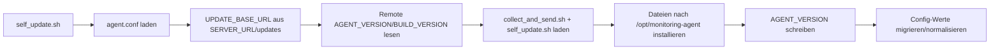
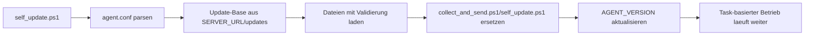
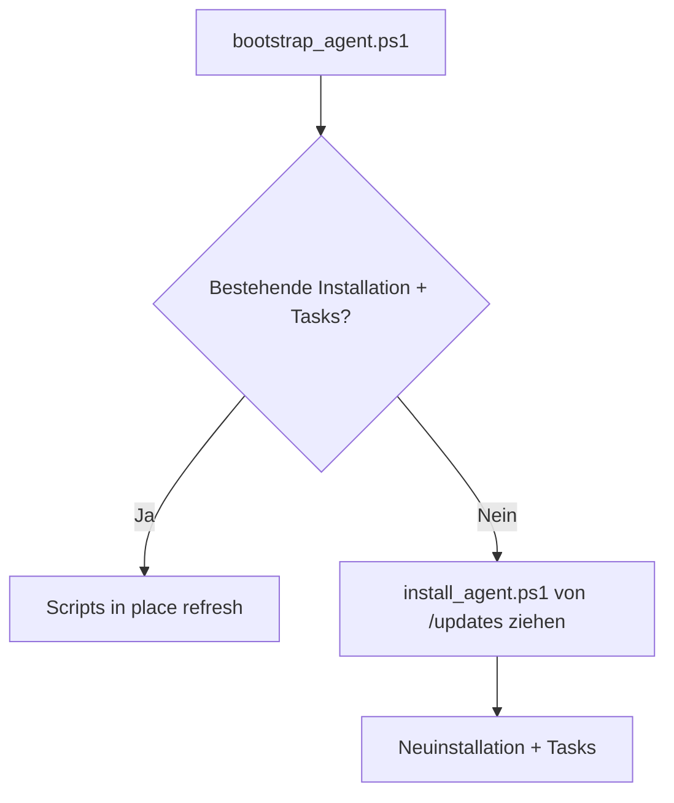

# 🔄 Agent Self-Update End-to-End

Kurzbeschreibung: Wie Linux- und Windows-Agenten Updates von /updates beziehen und lokal anwenden.

## Linux Flow

## Windows Flow

## Bootstrap-Sonderfall (Windows)

## Kernaussagen

- Update-Quelle ist serverzentrisch auf /updates ausgelegt.
- Linux und Windows aktualisieren Kernskripte in place.
- Bootstrap repariert bestehende Installationen oder installiert neu.
