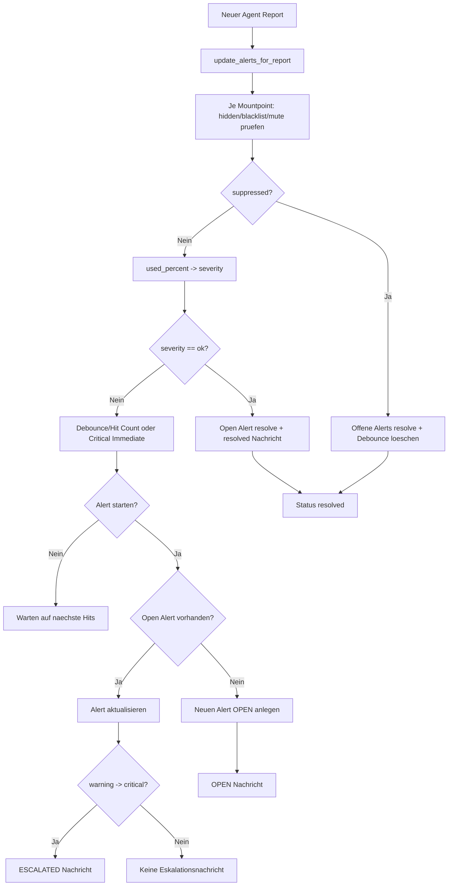
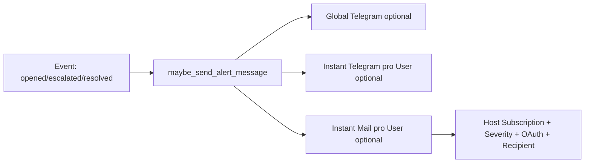

# 🚨 Alert Handling Gesamtprozess

Kurzbeschreibung: End-to-End Ablauf vom eingehenden Filesystem-Wert bis zu Open/Escalated/Resolved inkl. Mute, Ack, Close und Benachrichtigung.

## 🧭 Ablaufuebersicht

## 🔔 Notification Flow

## 🧷 Web-Aktionen auf Alerts

- Mute: POST /api/v1/alert-mute
- Unmute: POST /api/v1/alert-unmute
- Ack: POST /api/v1/alert-ack
- Unack: POST /api/v1/alert-unack
- Close: POST /api/v1/alert-close
- Unclose: POST /api/v1/alert-unclose

## 📌 Regeln

- Warning wird debounced (Hit Count + Zeitfenster).
- Critical kann sofort triggern (critical_trigger_immediate).
- Hidden/Blacklisted/Muted Mountpoints erzeugen keine offenen Alerts.
- Nicht mehr gemeldete Mountpoints werden automatisch resolved.
