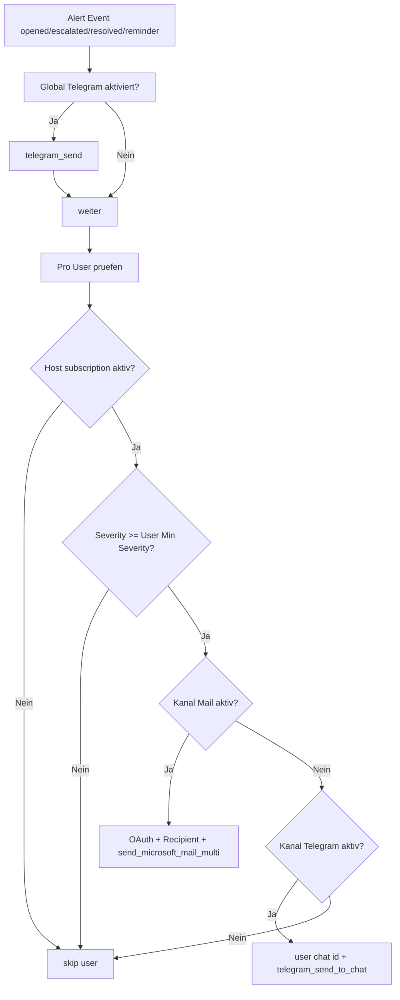

# 📬 Alert Notification Routing Matrix

Kurzbeschreibung: Welche Alerts an wen gesendet werden, ueber welche Kanaele und unter welchen Bedingungen.

## Routing-Entscheidung

## Matrix (vereinfachte Sicht)

| Kanal | Muss aktiv sein | Weitere Bedingungen |
|---|---|---|
| Global Telegram | alarm_settings.telegram_enabled + bot token + chat id | wird direkt aus maybe_send_alert_message versendet |
| Instant Mail pro User | alert_instant_mail_enabled + email_enabled + recipient + OAuth | Host-Subscription notify_mail und severity passt |
| Instant Telegram pro User | alert_instant_telegram_enabled + persönliche chat id + global bot token | Host-Subscription notify_telegram und severity passt |
| Alert Digest Mail | alert_email_enabled + Alert-Zeitpunkt faellig | Empfaenger aus resolve_user_alert_mail_recipients |
| Reminder Mail | alert_reminder_interval_hours > 0 | Nur offene Alerts, host-/severity-kompatibel |

## Wichtige Funktionen

- maybe_send_alert_message
- send_instant_alert_mails_to_users
- send_instant_alert_telegram_to_users
- maybe_send_alert_reminders
- maybe_send_scheduled_user_mails
