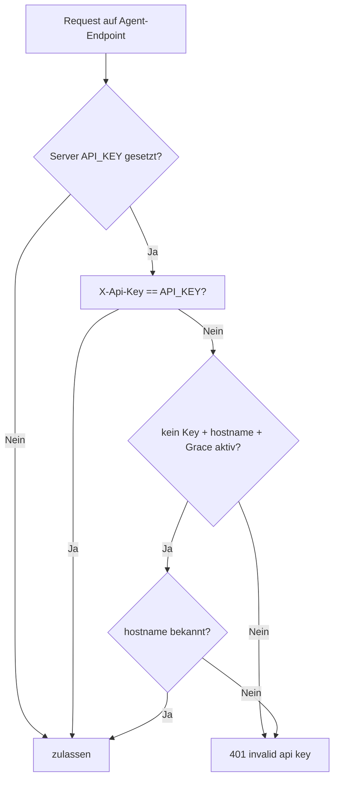

# 🛡 API-Key und Grace-Mode

Kurzbeschreibung: Authentisierung fuer Agent-Endpunkte mit optionalem Grace-Modus fuer bekannte Hosts.

## Entscheidungslogik

## Betroffene Endpunkte

- POST /api/v1/agent-report
- GET /api/v1/agent-commands
- POST /api/v1/agent-command-result

## Wichtige Parameter

- API_KEY
- MONITORING_API_KEY_GRACE_ALLOW_KNOWN_HOSTS

## Zweck des Grace-Modus

- Ermoeglicht Weiterbetrieb bereits bekannter Hosts waehrend Key-Rotation.
- Neue/unbekannte Hosts bleiben ohne gueltigen Key blockiert.
