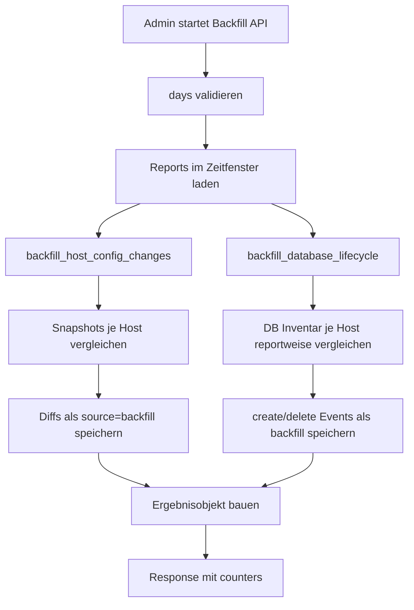

# ♻️ Backfill Prozess

Kurzbeschreibung: Rekonstruktion historischer Aenderungen aus alten Reports fuer Host-Config-Changes und Database-Lifecycle.

## ▶️ Trigger

- POST /api/v1/host-config-changes/backfill
- Optionales Parameterfeld: days (1..30)

## 🔄 Gesamtfluss

## 🧠 Host Config Backfill

- Reihenfolge: pro Host chronologisch nach Report-ID.
- Snapshot pro Report extrahieren.
- Gegen letzten Snapshot vergleichen.
- Signifikante Aenderungen als host_config_changes schreiben.
- Danach host_config_snapshot auf letzten Stand bringen.

## 🗄 Database Lifecycle Backfill

- Reihenfolge: pro Host chronologisch.
- Aktuelles DB-Inventar aus Payload extrahieren.
- Mengenvergleich gegen vorherigen Zustand.
- Neue DB -> create Event, fehlende DB -> delete Event.

## ✅ Output

- reports_scanned
- inserted_changes
- inserted_events
- zusammengesetztes result Objekt in der API-Antwort
