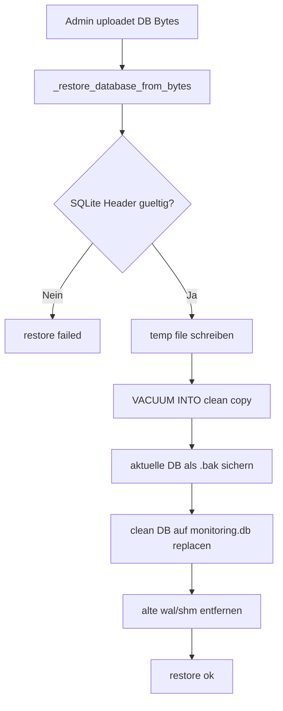

# 💾 Backup und Restore Prozess

Kurzbeschreibung: Dieser Ablauf beschreibt die serverseitige Sicherung der SQLite-Datenbank und das sichere Restore.

## Relevante Endpunkte

- GET /api/v1/backup/database/start
- GET /api/v1/backup/database/status?job_id=...
- GET /api/v1/backup/database/download?job_id=...
- POST /api/v1/restore/database

## Backup Flow

```mermaid
flowchart TD
    A[Admin startet Backup] --> B[/api/v1/backup/database/start]
    B --> C[_create_database_backup_job]
    C --> D[monitoring.db kopieren]
    D --> E[optional -wal/-shm mitkopieren]
    E --> F[Job in _backup_jobs als ready]
    F --> G[Status poll via /status]
    G --> H[Download via /download]
```

## Restore Flow



## Sicherheits- und Integritaetspunkte

- Restore wird nur fuer Admin-Session akzeptiert.
- Vor dem Ersetzen wird die aktuelle DB gesichert.
- WAL/SHM Altdateien werden nach Restore bereinigt.
