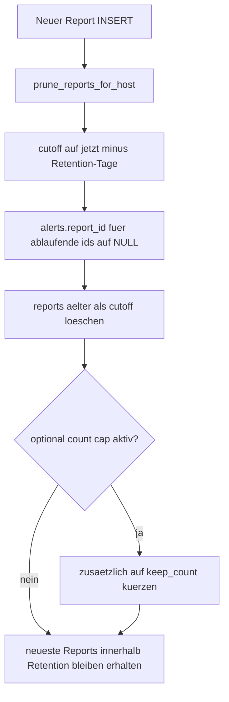

# 🧹 Datenaufbewahrung und Pruning

Kurzbeschreibung: Wie Reports pro Host begrenzt werden und welche Auswirkungen auf referenzierende Daten bestehen.

## Kernregel

- MONITORING_REPORT_RETENTION_DAYS steuert die zeitliche Aufbewahrung der Einzelmeldungen pro Host (Standard: 42 Tage = 6 Wochen).
- MONITORING_MAX_REPORTS_PER_HOST ist optional als zusaetzliche Obergrenze aktiv (0 = deaktiviert).
- Pruning laeuft im Report-Ingest direkt nach dem Insert.

## Ablauf

## Warum zuerst report_id auf NULL?

Damit Alerts bei Loeschung alter Reports keine ungueltigen Fremdbezuege behalten.

## Auswirkungen

- Trend- und Verlaufsauswertungen nutzen nur verbleibende Reports.
- Alert-Lifecycle bleibt konsistent, auch wenn historische report_id entfaellt.
- Speicherverbrauch bleibt begrenzt und vorhersehbar.
