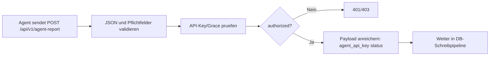
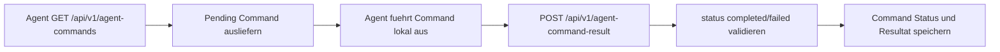

# 📥 Datenholung Prozess (Agent -> Server)

Kurzbeschreibung: Wie Reports und Command-Resultate vom Agent geholt bzw. empfangen werden.

## 🧭 Report Ingest

## 🧭 Command Poll/Result

## 🔍 Validierungen

- hostname muss vorhanden sein.
- filesystems muss ein Array sein.
- command_id und result status muessen gueltig sein.
- Agent-Endpunkte sind von Web-Session-Login ausgenommen, aber durch Agent-Auth geschuetzt.

## 📌 Warum getrennt von DB-Write?

Datenholung beschreibt Transport, Auth und API-Vertrag. Die persistente Verarbeitung steht im separaten Dokument zum DB-Schreiben.
