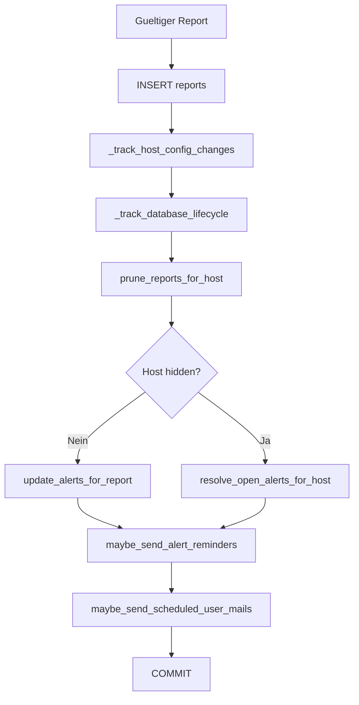

# 🗃️ Schreiben in die Datenbank

Kurzbeschreibung: Was nach einem gueltigen Agent-Report in SQLite geschrieben und aktualisiert wird.

## 🔄 Schreibpipeline nach /agent-report

## 🧩 Haupttabellen

- reports: Rohpayload pro Empfang
- alerts: aktiver/aufgeloester Alert-Status je Mountpoint
- alert_debounce: Warning Debounce Zustand
- host_config_changes + host_config_snapshot: Konfig-Aenderungen
- database_lifecycle: create/delete Events fuer DB-Inventar
- agent_commands: Queue und Ausfuehrungsstatus von Remote-Commands

## 🧹 Datenhygiene

- Reports werden pro Host auf MAX_REPORTS_PER_HOST begrenzt.
- Beim Prune werden report_id Referenzen in alerts vorher auf NULL gesetzt.
- Aufloesungen fuer alte/open Alerts laufen automatisch im Reportfluss.

## ✅ Transaktionale Sicht

Alle Schritte laufen innerhalb einer SQLite-Transaktion und werden am Ende gemeinsam committed.
