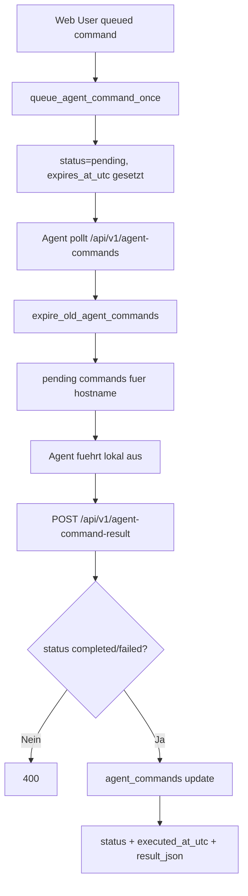

# 🎛 Remote-Command Lifecycle

Kurzbeschreibung: Dieser Ablauf beschreibt, wie Befehle fuer Agents gequeued, ausgeliefert, ausgefuehrt und als Resultat zurueckgeschrieben werden.

## Wichtige Endpunkte

- GET /api/v1/agent-commands
- POST /api/v1/agent-command
- POST /api/v1/agent-command-bulk
- POST /api/v1/agent-command-result

## Hauptfluss

## Sonderregeln

- Doppelte pending Commands werden via queue_agent_command_once verhindert.
- TTL wird begrenzt und abgelaufene Commands werden auf expired gesetzt.
- Bei set-api-key wird command_payload_json nach Rueckmeldung auf {} gesetzt.
- Resultate fuer bereits behandelte Commands werden als ignored beantwortet.

## Datenmodell

- Tabelle: agent_commands
- Kernfelder: command_type, command_payload_json, status, expires_at_utc, executed_at_utc, result_json
