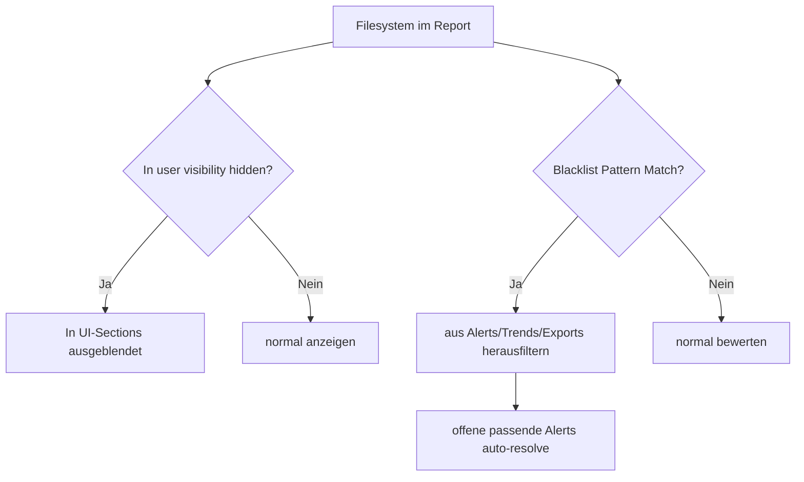

# 👁 Visibility und Blacklist Auswirkungen

Kurzbeschreibung: Wie ausgeblendete Mountpoints und Blacklist-Patterns Alerts, Trends und Auswertungen beeinflussen.

## Zusammenspiel

## Datenquellen

- filesystem_visibility (pro User, Host, Section)
- filesystem_blacklist_patterns (globale Pattern)

## Wirkung im Alerting

- Bei Blacklist-Match werden offene Alerts fuer betroffene Mountpoints resolved.
- Bei hidden Mountpoints in alert-relevanten Sections werden Alerts ebenfalls unterdrueckt.

## Wirkung in Auswertungen

- Critical Trends und Uebersichten filtern blacklisted Mountpoints.
- User-spezifische Hidden-Listen beeinflussen Analyse- und Fokus-Ansichten.

## Betriebsnutzen

- Weniger Alert-Rauschen fuer irrelevante Pfade.
- Saubere, user-spezifische Sicht auf wirklich relevante Filesysteme.
